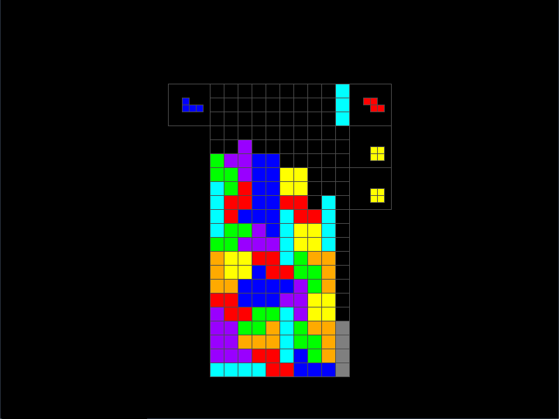

# Stack
A barebones modern Tetris clone. Only runs on Windows at the moment.

## Features

* Pluggable color scheme (Supports [TGM color scheme](http://tetris.wikia.com/wiki/Tetris_The_Grand_Master))
* [Pluggable rotation system](http://tetris.wikia.com/wiki/Category:Rotation_Systems) (Supports [SRS](http://tetris.wikia.com/wiki/SRS))
* [Wall kicks](http://tetris.wikia.com/wiki/Wall_kick)
* [T-Spins](http://tetris.wikia.com/wiki/T-Spin)
* Configurable [DAS](http://tetris.wikia.com/wiki/DAS) and DAS delay

